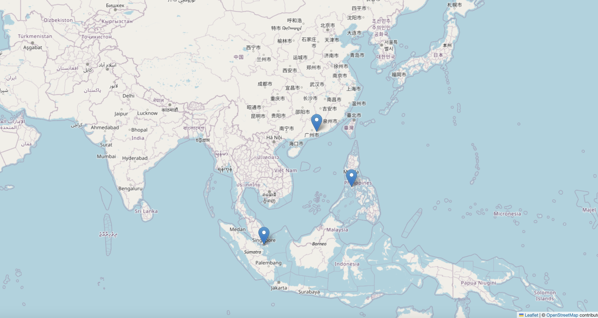

# OSINT-maritime-tracking
OSINT-based maritime traffic monitoring using open data and Python to analyze shipping routes, geopolitical risk, and supply chain disruptions.

# OSINT Maritime Tracking

This project explores how Open Source Intelligence (OSINT) can be used to monitor maritime traffic and visualize shipping routes.

The goal is to demonstrate how analysts can use Python and open data to track vessels, monitor strategic chokepoints, and analyze maritime risk.

## Project Features

- Maritime vessel visualization
- Interactive map using Python
- Basic OSINT methodology
- Geopolitical maritime monitoring

## Technologies

- Python
- Folium (interactive maps)
- Open maritime data

## OSINT Maritime Tools & Resources

This section lists useful open-source intelligence (OSINT) tools for maritime tracking, vessel analysis, geolocation, and supply chain monitoring.

---

### Ship Tracking and Information

- [MarineTraffic](https://www.marinetraffic.com/) – Real-time vessel tracking and port activity monitoring.
- [VesselFinder](https://www.vesselfinder.com/) – Global AIS-based ship position tracking.
- [Maritime Optima](https://maritimeoptima.com/) – Maritime analytics and fleet intelligence platform.
- [Shipspotting](https://www.shipspotting.com/) – Community platform for ship photography and vessel identification.
- [Shipinfo](https://shipinfo.net/) – Database of vessel ownership and technical specifications.
- [Equasis](https://www.equasis.org/) – International maritime database with inspection and ownership information.
- [IMO GISIS](https://gisis.imo.org/) – Global Integrated Shipping Information System from the International Maritime Organization.

---

### Container and Cargo Tracking

- [Track Trace](https://www.track-trace.com/) – Multi-carrier container tracking system.
- [Searates](https://www.searates.com/) – Logistics platform for cargo and container tracking.

---

### Geolocation and Mapping Tools

- [Google Maps](https://maps.google.com/)
- [Google Earth](https://earth.google.com/)
- [Bing Maps](https://www.bing.com/maps)
- [OpenStreetMap](https://www.openstreetmap.org/)
- [Zoom Earth](https://zoom.earth/)
- [Maxar](https://www.maxar.com/)
- [WikiMapia](http://wikimapia.org/)
- [Geonames](https://www.geonames.org/)

---

### Maritime Data and Analysis

- [MarineCadastre](https://marinecadastre.gov/) – Historical vessel traffic data.
- AIS Handbook – Guide to understanding AIS maritime tracking systems.

---

### Maritime Infrastructure

- [SubTel Cable Map](https://www.submarinecablemap.com/) – Global submarine cable infrastructure map.
- [Signal Port Optimizer](https://signal.portoptimizer.com/) – Port logistics monitoring system.

---

### General OSINT Tools

- [Shodan](https://www.shodan.io/) – Search engine for internet-connected devices and maritime systems.

## Strategic Maritime Chokepoints

This repository focuses on maritime monitoring across key global chokepoints where trade flows are concentrated and geopolitical risks are highest.
## 🌍 Strategic Maritime Chokepoints

Strategic maritime chokepoints are narrow sea routes where large volumes of global trade and energy shipments pass. Monitoring these locations is critical for geopolitical risk analysis, maritime security, and supply chain intelligence.

---

## Middle East & Global Energy Routes

- 📍 Strait of Hormuz
- 📍 Bab el-Mandeb
- 📍 Suez Canal

---

## Europe & Mediterranean

- 📍 Strait of Gibraltar
- 📍 Bosporus Strait
- 📍 Dardanelles Strait
- 📍 Turkish Straits

---

## Northern Europe & Baltic Access

- 📍 Øresund Strait
- 📍 Great Belt
- 📍 Little Belt
- 📍 Danish Straits

---

## Asia-Pacific (World’s Busiest Trade Routes)

- 📍 Strait of Malacca
- 📍 Singapore Strait
- 📍 Sunda Strait
- 📍 Lombok Strait
- 📍 Makassar Strait
- 📍 Taiwan Strait
- 📍 Luzon Strait
- 📍 Torres Strait

---

## Africa & Indian Ocean

- 📍 Mozambique Channel
- 📍 Cape of Good Hope

---

## Americas

- 📍 Panama Canal
- 📍 Strait of Florida

---

## Arctic Routes

- 📍 Bering Strait

---

## Southern Ocean Routes

- 📍 Strait of Magellan
- 📍 Drake Passage

---

## Why These Chokepoints Matter

These maritime passages are critical for:

- Global energy flows
- Supply chain logistics
- Naval strategy
- Maritime security
- Geopolitical risk monitoring

Tracking vessel activity in these areas helps analysts detect disruptions, sanctions evasion, illegal shipping, and strategic naval movements.

## Use Cases

- Maritime security analysis
- Supply chain monitoring
- Geopolitical risk assessment
- OSINT research

## Future Improvements

- Integration with AIS maritime data
- Automated vessel tracking
- Risk dashboards
